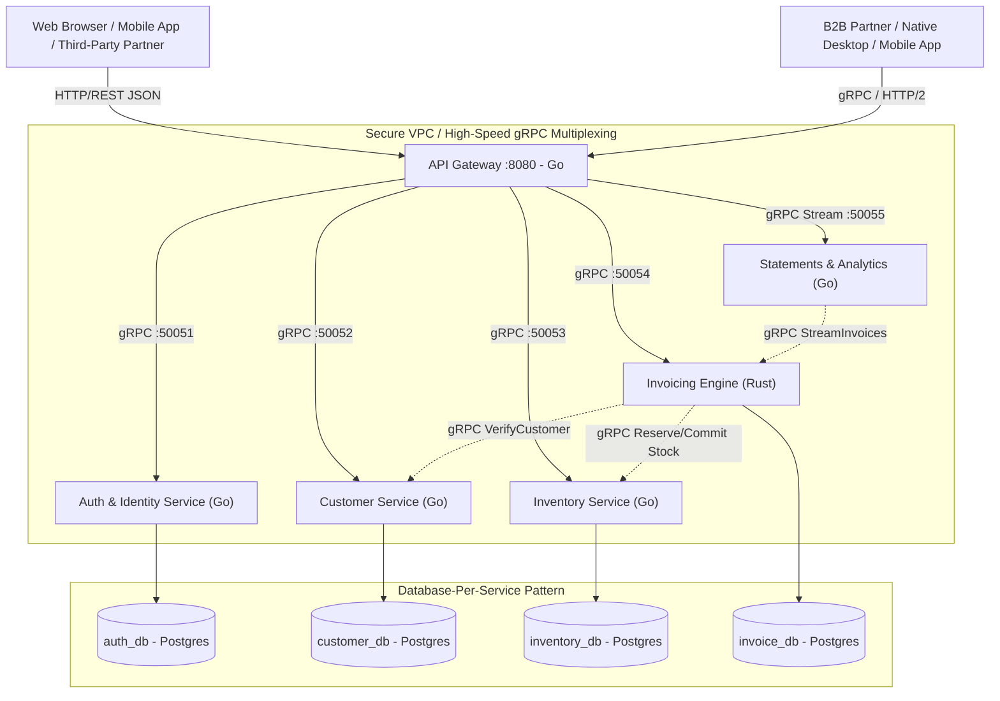
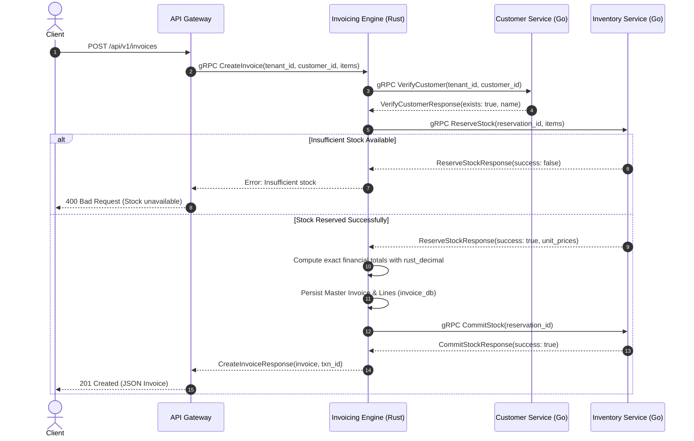

# Accounting Microservices

[](https://github.com/accounting-microservices)
[](https://github.com/accounting-microservices)
[%20%2B%20REST-green.svg)](https://github.com/accounting-microservices)
[](http://localhost:8080/docs)
[](LICENSE)

An enterprise-grade, high-performance polyglot microservices platform ported from the monolithic [**`accounting-node.TS`**](file:///home/zoro/Projects/github/accounting-node.TS) and [**`accounting-node.js`**](file:///home/zoro/Projects/github/accounting-node.js) codebases.

Engineered with **Rust**, **Go**, **gRPC (HTTP/2 + Protocol Buffers v3)** for internal service-to-service communication, and a unified **REST API Gateway** with an interactive **Swagger UI** for external client consumers.

---

## Authors & Maintainers

- **Antigravity** (Google DeepMind Advanced Agentic Coding)
- **Vinayak Gupta** ([@Vinayakguta29](https://github.com/vinayakguta29))

---

## Table of Contents

- [System Architecture](#system-architecture)
- [Monolith vs. Microservices Migration Matrix](#monolith-vs-microservices-migration-matrix)
- [Polyglot Language Selection Strategy](#polyglot-language-selection-strategy)
- [Protocol Design: gRPC vs. REST](#protocol-design-grpc-vs-rest)
- [Distributed Transactions & The Saga Pattern](#distributed-transactions--the-saga-pattern)
- [Database Architecture & Multi-Tenancy Redesign](#database-architecture--multi-tenancy-redesign)
- [Service Catalog](#service-catalog)
- [Directory Structure](#directory-structure)
- [Interactive Swagger UI & API Reference](#interactive-swagger-ui--api-reference)
- [Getting Started & Local Deployment](#getting-started--local-deployment)
  - [Prerequisites](#prerequisites)
  - [Option A: Running with Docker Compose (Recommended)](#option-a-running-with-docker-compose-recommended)
  - [Option B: Running Microservices Locally](#option-b-running-microservices-locally)
- [API Usage Examples (cURL)](#api-usage-examples-curl)
- [License](#license)

---

## System Architecture



---

## Monolith vs. Microservices Migration Matrix

| Architectural Dimension | Monolith (`accounting-node.TS`) | Microservices (`accounting-microservices`) |
| :--- | :--- | :--- |
| **Language Ecosystem** | Single TypeScript / Node.js codebase | **Polyglot**: Go for high-throughput I/O + Rust for financial safety |
| **Tenancy Isolation** | Dynamic SQL tables per user (`${username}_invoices`) | **Enterprise Multi-Tenancy**: `tenant_id` partitioning with PostgreSQL RLS |
| **Communication** | Direct in-memory function calls & shared SQL pool | **gRPC (HTTP/2 + Protobuf v3)** inter-service + REST API Gateway |
| **Financial Arithmetic** | JavaScript floating-point numbers (`Math.round`) | **Rust `rust_decimal`**: Exact 128-bit fixed-point decimal arithmetic |
| **Transaction Safety** | Local DB transactions (`BEGIN ... COMMIT`) | **Distributed Saga Pattern**: Coordinated Stock Reservation & Commit |
| **Documentation** | Static OpenAPI YAML file | **Dynamic Swagger UI**: Embedded in Go Gateway (`/docs`) |
| **Scalability** | Scale whole monolith uniformly | **Independent Horizontal Autoscaling** per microservice |

---

## Polyglot Language Selection Strategy

Rather than being bound to a single runtime, each microservice leverages the programming language whose strengths align with the service's domain:

```
+-------------------------------------------------------------------------------+
| SERVICE            | LANGUAGE | PRIMARY SELECTION RATIONALE                   |
+--------------------+----------+-----------------------------------------------+
| API Gateway        | Go       | High-concurrency goroutines, sub-ms routing,  |
|                    |          | native gRPC multiplexing & HTTP reverse proxy |
+--------------------+----------+-----------------------------------------------+
| Auth & Identity    | Go       | Hardware-accelerated Argon2id, stateless JWTs |
+--------------------+----------+-----------------------------------------------+
| Customer Service   | Go       | Rapid validation, clean PostgreSQL pools      |
+--------------------+----------+-----------------------------------------------+
| Inventory Service  | Go       | Atomic stock reservations, concurrent locks   |
+--------------------+----------+-----------------------------------------------+
| Invoicing Engine   | Rust     | Absolute memory safety, zero-cost tonic gRPC, |
|                    |          | rust_decimal guarantees zero financial drift  |
+--------------------+----------+-----------------------------------------------+
| Statements Service | Go       | High-speed streaming aggregations & analytics |
+--------------------+----------+-----------------------------------------------+
```

### Why Rust for Invoicing?
Financial ledgers cannot tolerate floating-point imprecision (`0.1 + 0.2 = 0.30000000000000004` in standard JS/C floating-point). Rust provides:
1. **`rust_decimal`**: 128-bit fixed-point representation preventing currency rounding discrepancies.
2. **Compile-Time Memory Safety**: Eliminates data races and memory leaks without requiring garbage collector pauses.
3. **`tonic` gRPC Performance**: World-class throughput and sub-millisecond serialization speeds.

### Why Go for Gateway & I/O Services?
Go's lightweight goroutine scheduler allows handling hundreds of thousands of concurrent network connections with minimal RAM (~20–30MB per container). Native gRPC tooling in Go compiles seamlessly into fast, static binaries with instant container startup times.

---

## Protocol Design: gRPC vs. REST

### Internal Service-to-Service: Strict gRPC
- **Multiplexed HTTP/2 Streams**: Multiple calls share a single TCP connection, eliminating connection handshake latency.
- **Protocol Buffers v3**: Strongly-typed binary contracts that are 3x–10x smaller and 5x–20x faster to serialize than JSON.
- **Bi-directional Streaming**: Used by Statement Service to stream millions of invoice lines without buffering entire tables into RAM.

### Client-to-Server: Dual-Protocol (REST + Native gRPC)
- **Primary REST Ingress**: Web browsers, frontends, and external third parties interact with JSON over HTTP/1.1 and HTTP/2.
- **Interactive Swagger UI**: Served directly at `/docs` backed by OpenAPI 3.0 specification.
- **Direct gRPC Ingress**: Mobile apps (Flutter/iOS/Android) and enterprise B2B servers can connect directly to the gRPC port for binary throughput.

---

## Distributed Transactions & The Saga Pattern

When a customer checks out and an invoice is created, the system executes an automated distributed saga across three microservices:



If an unrecoverable failure occurs during invoice recording, the Invoicing Engine issues a `ReleaseStock` compensating action to restore reserved inventory back to available stock.

---

## Database Architecture & Multi-Tenancy Redesign

In the legacy monolithic codebase, multi-tenancy was handled by creating dynamic tables per user:
```sql
-- Legacy Monolith: Created 4+ new tables for EVERY registered user
CREATE TABLE user123_invoices (...);
CREATE TABLE user123_customers (...);
```
**Why this failed at scale**:
1. 10,000 tenants generated 40,000+ tables, exhausting PostgreSQL inode limits and cache buffer pools.
2. DDL migrations could not be applied atomically across dynamic table names.
3. Prepared statement caching was disabled.

### The New Architecture: Database-Per-Service + Row-Level Tenancy
Each microservice owns a dedicated PostgreSQL database schema, fully isolated from other services:
- **`auth_db`**: Global user directory and credentials.
- **`customer_db`**: Multi-tenant customer profiles indexed by `(tenant_id, cust_id)`.
- **`inventory_db`**: Stock catalog and active reservations indexed by `(tenant_id, product_id)`.
- **`invoice_db`**: Immutable financial ledger and line items indexed by `(tenant_id, transaction_id)`.

Every table includes a mandatory `tenant_id VARCHAR(64) NOT NULL` column. PostgreSQL Row-Level Security (RLS) ensures that tenant data can never leak between organizations.

---

## Service Catalog

| Service | Port | Protocol | Language | Source Directory | Description |
| :--- | :--- | :--- | :--- | :--- | :--- |
| **API Gateway** | `8080` | HTTP / REST | Go 1.24 | [`gateway/`](file:///home/zoro/Projects/github/accounting-microservices/gateway) | Ingress proxy, JWT auth guard, Swagger UI, Gzip compression |
| **Auth Service** | `50051` | gRPC | Go 1.24 | [`services/auth/`](file:///home/zoro/Projects/github/accounting-microservices/services/auth) | Argon2id password hashing, JWT token issuance & claims verification |
| **Customer Service** | `50052` | gRPC | Go 1.24 | [`services/customer/`](file:///home/zoro/Projects/github/accounting-microservices/services/customer) | Multi-tenant customer directory, sequential ID generator (`cust_001`) |
| **Inventory Service** | `50053` | gRPC | Go 1.24 | [`services/inventory/`](file:///home/zoro/Projects/github/accounting-microservices/services/inventory) | Stock catalog, unit prices, atomic `ReserveStock` and `CommitStock` |
| **Invoicing Engine** | `50054` | gRPC | Rust 1.80 | [`services/invoicing/`](file:///home/zoro/Projects/github/accounting-microservices/services/invoicing) | Exact financial arithmetic, Saga coordination, line calculation |
| **Statement Service** | `50055` | gRPC | Go 1.24 | [`services/statement/`](file:///home/zoro/Projects/github/accounting-microservices/services/statement) | Date filtering (`today`, `thisMonth`, `thisQuarter`), streaming audit ledger |

---

## Directory Structure

```text
accounting-microservices/
├── Makefile                        # Central build, test, and orchestration recipes
├── docker-compose.yml              # Complete multi-container orchestration
├── README.md                       # Comprehensive platform documentation
├── go.mod                          # Root Go module
├── go.sum                          # Checksums for Go dependencies
├── proto/                          # Canonical Protocol Buffer definitions
│   ├── auth/v1/auth.proto
│   ├── customer/v1/customer.proto
│   ├── inventory/v1/inventory.proto
│   ├── invoice/v1/invoice.proto
│   └── statement/v1/statement.proto
├── gen/                            # Compiled Protocol Buffer stubs
│   └── go/                         # Go gRPC and protobuf generated packages
├── gateway/                        # Go API Gateway & REST Ingress
│   ├── cmd/server/main.go          # HTTP server, gRPC clients & route mapping
│   ├── internal/
│   │   ├── docs/swagger.go         # Embedded Swagger UI and OpenAPI 3.0 JSON
│   │   ├── handlers/handlers.go    # HTTP handlers delegating to gRPC services
│   │   └── middleware/             # JWT auth validation & Gzip compression
│   └── Dockerfile
├── services/
│   ├── auth/                       # Go Auth & Identity Service
│   │   ├── cmd/server/main.go
│   │   ├── internal/
│   │   │   ├── crypto/password.go  # Argon2id password hashing
│   │   │   ├── token/jwt.go        # JWT creation & claims parsing
│   │   │   ├── repository/         # PostgreSQL & thread-safe memory store
│   │   │   └── service/            # gRPC AuthService implementation
│   │   └── Dockerfile
│   ├── customer/                   # Go Customer Service
│   │   ├── cmd/server/main.go
│   │   ├── internal/
│   │   │   ├── repository/         # Sequential ID generation & tenant isolation
│   │   │   └── service/            # gRPC CustomerService implementation
│   │   └── Dockerfile
│   ├── inventory/                  # Go Inventory Management Service
│   │   ├── cmd/server/main.go
│   │   ├── internal/
│   │   │   ├── repository/         # Stock deduction, reservations & commits
│   │   │   └── service/            # gRPC InventoryService implementation
│   │   └── Dockerfile
│   ├── invoicing/                  # Rust Invoicing & Billing Engine
│   │   ├── Cargo.toml              # Rust crate dependencies (tonic, rust_decimal)
│   │   ├── build.rs                # Rust tonic_build protobuf compilation
│   │   ├── src/
│   │   │   ├── main.rs             # Tokio async runtime & gRPC server
│   │   │   ├── model.rs            # Exact Decimal financial structures
│   │   │   ├── db.rs               # Thread-safe invoice store
│   │   │   └── service.rs          # gRPC InvoiceService with Saga coordination
│   │   └── Dockerfile
│   └── statement/                  # Go Statement & Reporting Service
│       ├── cmd/server/main.go
│       ├── internal/
│       │   ├── aggregator/         # Temporal date filters & summaries
│       │   └── service/            # gRPC StatementService implementation
│       └── Dockerfile
└── deployments/
    └── init-db.sql                 # PostgreSQL multi-database schema initialization
```

---

## Interactive Swagger UI & API Reference

The API Gateway hosts an interactive **Swagger UI** for testing and exploring the complete microservices API:

- **Swagger UI Web Interface**: [**`http://localhost:8080/docs`**](http://localhost:8080/docs)
- **OpenAPI 3.0 Specification JSON**: [**`http://localhost:8080/docs/swagger.json`**](http://localhost:8080/docs/swagger.json)
- **Health Check**: [**`http://localhost:8080/health`**](http://localhost:8080/health)

---

## Getting Started & Local Deployment

### Prerequisites
- **Docker** and **Docker Compose** (for containerized deployment), or:
- **Go** (>= 1.22), **Rust / Cargo** (>= 1.78), and **Protoc** (>= 3.0)

### ⚡ Option A: Run Everything with a Single Command (`make run`)

All microservices feature automatic fallback to thread-safe in-memory stores when running standalone without PostgreSQL. You can start the **entire microservices mesh + API Gateway** with a single command:

```bash
# Compile and boot all 5 microservices + API Gateway simultaneously
make run
```
*Press `CTRL+C` to gracefully stop all background microservice processes at once.*

---

### 🐳 Option B: Running with Docker Compose (`make docker-run`)

1. Start all containerized microservices and PostgreSQL databases:
   ```bash
   make docker-run
   # Or: docker compose up --build -d
   ```

2. Open the interactive Swagger UI documentation in your browser:
   👉 [**`http://localhost:8080/docs`**](http://localhost:8080/docs)

3. Stop the Docker cluster:
   ```bash
   make docker-down
   # Or: docker compose down
   ```

---

### 🧹 Cleanup & Reset Commands

| Command | Action | Scope |
| :--- | :--- | :--- |
| **`make clean`** | Cleans all compiled executables (`bin/`) and the Rust Cargo target cache (`services/invoicing/target/`). | Local build artifacts |
| **`make docker-clean`** | Stops Docker containers, removes networks, and **wipes all PostgreSQL database volumes** (`postgres_data`). | Containers & DB data |
| **`make docker-clean-all`** | Stops containers, wipes DB volumes, and **deletes all downloaded & composed Docker images** (`--rmi all`). | Containers, DB & Images |
| **`make clean-all`** | **Nuclear Reset**: Cleans all local binaries/Cargo targets AND wipes all Docker containers, DB volumes, and images. | Full environment reset |

---

## API Usage Examples (cURL)

### 1. Register a Tenant User
```bash
curl -X POST http://localhost:8080/api/v1/auth/signup \
  -H "Content-Type: application/json" \
  -d '{
    "name": "Jane Doe",
    "username": "janedoe",
    "email": "jane@example.com",
    "password": "SecurePassword123!",
    "gstin": "29ABCDE1234F1Z5",
    "pan": "ABCDE1234F",
    "aadhaar": "123456789012",
    "phone": "9876543210",
    "address": "Bangalore, India"
  }'
```

### 2. Login & Obtain JWT Token
```bash
curl -X POST http://localhost:8080/api/v1/auth/login \
  -H "Content-Type: application/json" \
  -d '{
    "username": "janedoe",
    "password": "SecurePassword123!"
  }'
```
*Save the returned `token` string for subsequent authenticated calls.*

### 3. Register a Customer
```bash
curl -X POST http://localhost:8080/api/v1/customers \
  -H "Authorization: Bearer <YOUR_JWT_TOKEN>" \
  -H "Content-Type: application/json" \
  -d '{
    "name": "Acme Global Industries",
    "address": "42 Tech Boulevard",
    "phone_number": "9876543210",
    "email": "billing@acme.com",
    "gstin": "29AAAAA0000A1Z5",
    "dealer_type": "Regular",
    "pan_card": "AAAAA0000A",
    "aadhaar": "987654321098"
  }'
```

### 4. Add Inventory Stock
```bash
curl -X POST http://localhost:8080/api/v1/inventory \
  -H "Authorization: Bearer <YOUR_JWT_TOKEN>" \
  -H "Content-Type: application/json" \
  -d '{
    "product_name": "Precision Sensor X1",
    "quantity": 250,
    "unit_price": 45.50
  }'
```

### 5. Create an Invoice (Executed by Rust Invoicing Engine)
```bash
curl -X POST http://localhost:8080/api/v1/invoices \
  -H "Authorization: Bearer <YOUR_JWT_TOKEN>" \
  -H "Content-Type: application/json" \
  -d '{
    "customer_id": "cust_001",
    "total_discount": 50.00,
    "packaging": 20.00,
    "freight": 30.00,
    "tax_collected_at_source": 0.00,
    "round_off": 0.00,
    "method_of_payment": "Wire Transfer",
    "lines": [
      {
        "product_id": 1,
        "quantity": 10
      }
    ]
  }'
```

### 6. Retrieve Account Statement (Gzip Supported)
```bash
curl -X GET "http://localhost:8080/api/v1/statements?action=thisMonth" \
  -H "Authorization: Bearer <YOUR_JWT_TOKEN>" \
  --compressed
```

### 7. Retrieve Analytics Data Points
```bash
curl -X GET "http://localhost:8080/api/v1/analytics" \
  -H "Authorization: Bearer <YOUR_JWT_TOKEN>"
```

---

## License

GNU General Public License v3.0 (GPL-3.0). See [LICENSE](LICENSE) for details.
